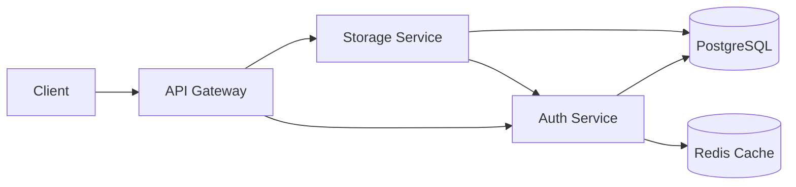

# 🚀 CloudIgnite  
### *Build, Deploy & Scale — Without Infrastructure Headaches*

<p align="center">
  
  
  
  
  
</p>

---

## 🌟 Overview

**CloudIgnite** is a developer-first cloud platform inspired by Firebase and AWS, designed to provide **secure, scalable backend infrastructure**.

> ⚡ Build powerful applications without worrying about backend complexity.

---

## ✨ Features

### 🔐 Authentication Service
- Multi-tenant architecture (per project isolation)
- JWT Authentication (**RS256**)  
- JWKS endpoint for public key distribution  
- API Key system (`pk_ci_*`, `sk_ci_*`)  
- Session-based authentication with refresh tokens  
- Middleware-based security (rate limiting, quotas)

---

### 📦 Storage Service *(In Progress)*
- Bucket-based object storage  
- Policy-based access control  
- Multipart uploads  
- Object versioning  
- Presigned URLs *(coming soon)*  

---

### ⚡ Core Capabilities
- 🔒 Secure key hashing (SHA-256)
- 🔁 One-time secret exposure
- ⚙️ Modular microservice architecture
- 🚀 High-performance middleware
- 🧠 Redis caching support

---

## 🧱 Architecture



---

## 🔐 Security

- RS256 JWT (no shared secrets)
- Per-project isolation
- API keys stored as hashes (never plaintext)
- Issuer & audience validation
- Secure token generation

---

## 🛠 Tech Stack

| Layer        | Technology |
|-------------|-----------|
| Backend     | Go (Gin)  |
| Database    | PostgreSQL |
| Cache       | Redis     |
| Auth        | JWT (RS256) |
| Infra       | Docker + NGINX *(planned)* |

---

## 🚀 Getting Started

### 1. Clone the repository
```bash
git clone https://github.com/YOUR_USERNAME/cloudignite.git
cd cloudignite
```

### 2. Setup environment
Create a `.env` file:

```env
PORT=8081
DATABASE_URL=your_postgres_url
REDIS_URL=your_redis_url
```

### 3. Run Auth Service
```bash
cd auth-service
go run main.go
```

### 4. Health Check
```bash
GET /health
```

---

## 🔑 API Overview

### Auth Routes
```http
POST /v1/auth/signup
POST /v1/auth/login
POST /v1/auth/refresh
GET  /v1/auth/me
```

### Admin Routes
```http
POST /v1/admin/users
GET  /v1/admin/users
POST /v1/admin/projects/:id/rotate-keys
```

---

## 🔁 Authentication Flow

```
User → Login → JWT Issued  
JWT → API Requests  
Storage → Verify via JWKS  
Refresh Token → Maintain session
```

---

## 📦 Release

### 🟢 v1.0.0
- Auth Service (RS256 JWT + JWKS)
- API key system
- Session management
- Middleware security

---

## 🧠 Roadmap

### 🔥 Next (v2)
- Zero-downtime key rotation  
- Redis-based JWKS cache  
- Token revocation system  
- Storage service completion  

### ⚡ Future
- Serverless functions  
- Real-time database  
- Role-based access control (RBAC)  
- Billing & analytics  

---

## 🤝 Contributing

Contributions, ideas, and feedback are welcome 🚀

---

## 👨‍💻 Author

**Arpit Rangi**  
CloudIgnite Project  

---

## ⭐ Final Thought

> CloudIgnite is not just a project —  
> it’s a step toward building a **full cloud platform from scratch**.
